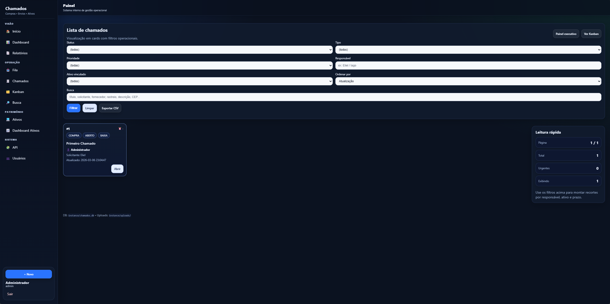
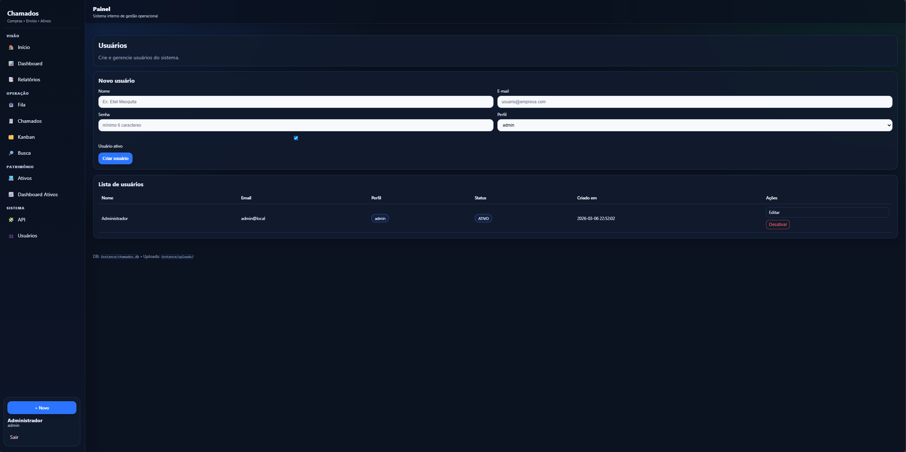
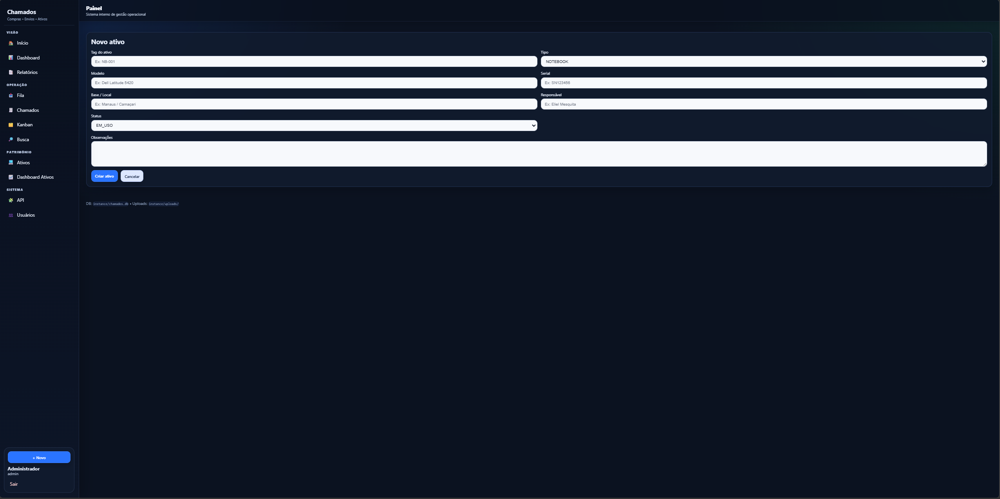

# 🎫 Gerenciador de Chamados, Compras e Envios de TI

Sistema web completo para gestão operacional de chamados de suporte, compras e envios de equipamentos de TI — desenvolvido em **Python · Flask · SQLite**.

> **Stack:** Python 3.11+ · Flask 3 · SQLite · Jinja2 · Chart.js · HTML/CSS puro (sem framework)

---

## ✨ Funcionalidades principais

| Módulo | Descrição |
|---|---|
| **Portal do Solicitante** | Abertura simplificada de chamados, acompanhamento em tempo real, bloqueio automático de edição quando em atendimento |
| **Fila Operacional** | Visão para operadores/admins assumirem chamados, destaque visual para chamados sem responsável |
| **Dashboard com Gráficos** | KPIs em tempo real, Chart.js com gráficos de status, prioridade, aging e top responsáveis |
| **Kanban** | Quadro visual drag-and-drop com colunas por status |
| **Relatórios & SLA** | Exportação em XLSX e PDF, tempo médio de resolução, % dentro do SLA |
| **Gestão de Ativos** | Cadastro de equipamentos, histórico, dashboard de ativos |
| **Notificações por e-mail** | Envio assíncrono via SMTP ao criar chamado, assumir e mudar status |
| **API REST** | Endpoints JSON para integração com outros sistemas |
| **Testes automatizados** | Suite com pytest cobrindo autenticação, permissões, modelos e rotas |
| **Paginação** | Listagem de chamados com 25 por página e navegação |

---

## 🔐 Perfis de acesso

| Perfil | Acesso |
|---|---|
| `admin` | Acesso total — usuários, chamados, ativos, relatórios |
| `operador` | Fila, chamados, ativos — sem gestão de usuários |
| `solicitante` | Abertura e acompanhamento dos próprios chamados |
| `viewer` | Visualização somente leitura |

---


## 🔒 Segurança

| Proteção | Implementação |
|---|---|
| **CSRF** | Flask-WTF — token automático em todos os formulários POST; fetch do Kanban envia `X-CSRFToken` via header |
| **Rate Limiting** | flask-limiter — login limitado a 10 tentativas/min por IP; criação de chamados limitada a 20/h (solicitante) e 60/h (operador/admin); API limitada a 200 req/h |
| **Senhas** | Hashed com Werkzeug (PBKDF2-SHA256) |
| **Sessões** | Flask session assinada com `SECRET_KEY` |
| **Uploads** | Validação de extensão + nome sanitizado com `secure_filename` |

> Em produção, configure `RATELIMIT_STORAGE_URI=redis://...` para que os limites persistam entre reinicializações do servidor.

## 🚀 Como rodar localmente

```bash
# Clone e entre na pasta
git clone <seu-repo>
cd projeto

# Crie o ambiente virtual e instale dependências
python -m venv .venv
source .venv/bin/activate       # Linux/Mac
.venv\Scripts\activate          # Windows

pip install -r requirements.txt

# Inicialize o banco
python -m app.cli init-db

# Rode o servidor
python run.py
```

Acesse em [http://localhost:5000](http://localhost:5000)

**Login padrão:**
- E-mail: `admin@local`
- Senha: `admin123`

> ⚠️ Altere as credenciais padrão via variáveis de ambiente antes de usar em produção.

---

## ⚙️ Variáveis de ambiente

Copie `.env.example` para `.env` e preencha:

```env
SECRET_KEY=sua-chave-secreta-aqui
ADMIN_DEFAULT_EMAIL=admin@suaempresa.com
ADMIN_DEFAULT_PASSWORD=senha-forte-aqui

# SMTP para notificações por e-mail (opcional)
SMTP_HOST=smtp.gmail.com
SMTP_PORT=587
SMTP_USER=seu@gmail.com
SMTP_PASS=sua-senha-de-app
SMTP_FROM=chamados@suaempresa.com
ALERT_TO_EMAILS=equipe@suaempresa.com
```

---

## 🧪 Testes

A suíte foi organizada para funcionar com **pytest** a partir da **raiz do projeto**, usando imports absolutos e mantendo o scheduler desabilitado durante os testes.

### Pré-requisitos

```bash
pip install -r requirements.txt
```

### Como executar

```bash
python -m pytest
```

ou, se quiser mais detalhes:

```bash
python -m pytest -v
```

### O que foi ajustado na infraestrutura de testes

- `pytest.ini` define `pythonpath = .` e `testpaths = tests`
- `tests/conftest.py` garante a raiz do projeto no `sys.path`
- o `APScheduler` continua mockado nos testes e não inicia jobs reais
- `create_app(config_object=...)` agora aceita configuração de teste antes da inicialização completa da aplicação

A suíte cobre: importação da app, autenticação, criação e validação de chamados, paginação, permissões por perfil, API, recorrência, backup, digest e regras principais de negócio.

---

## 🌐 Deploy

### Render (gratuito)
```bash
# Já inclui render.yaml configurado
git push origin main
# Configure as env vars no painel do Render
```

### Docker
```bash
docker compose up --build
```

---

## 📁 Estrutura do projeto

```
app/
├── __init__.py          # Factory da aplicação Flask
├── models.py            # Toda a lógica de dados e queries
├── routes.py            # Rotas principais (chamados)
├── auth.py              # Autenticação e decoradores de permissão
├── admin.py             # Gestão de usuários
├── api.py               # API REST JSON
├── reports.py           # Relatórios e exportações
├── assets_admin.py      # Módulo de ativos de TI
├── notify.py            # Sistema de notificações por e-mail (async)
├── db.py                # Conexão, schema e migrações SQLite
├── config.py            # Configurações via env vars
├── services/            # Camada de serviço (auth, users, assets, reports)
├── templates/           # Templates Jinja2
└── static/              # CSS (design system próprio, tema dark)
tests/
└── test_smoke.py        # Suite de testes com pytest (30+ casos)
```

---
# 🎫 Gerenciador de Chamados, Compras e Envios de TI

Sistema web completo para gestão operacional de chamados de suporte, compras e envios de equipamentos de TI — desenvolvido em **Python · Flask · SQLite**.

> **Stack:** Python 3.11+ · Flask 3 · SQLite · Jinja2 · Chart.js · HTML/CSS puro (sem framework)

---

# 🎬 Demonstração do Sistema

## Login


## Tela inicial


---

# 📊 Dashboard


---

# 🎫 Gestão de Chamados

## Fila operacional


## Lista de chamados


## Tratamento do chamado


## Abertura de chamado


---

# 🧩 Kanban de Chamados


---

# 🔎 Busca Geral


---

# 👥 Gestão de Usuários




---

# 💻 Gestão de Ativos

## Cadastro de ativo


## Demonstração de ativos


---

# 🔌 API


---

## ✨ Funcionalidades principais


## 🛠️ Tecnologias

- **Backend:** Python 3.11, Flask 3, Werkzeug, SQLite
- **Frontend:** HTML5, CSS3 customizado (dark theme), Chart.js, Vanilla JS
- **Exportação:** openpyxl (XLSX), ReportLab (PDF)
- **Deploy:** Gunicorn, Docker, Render-ready
- **Testes:** pytest

---

## 📄 Licença

MIT — sinta-se livre para usar, adaptar e distribuir.
