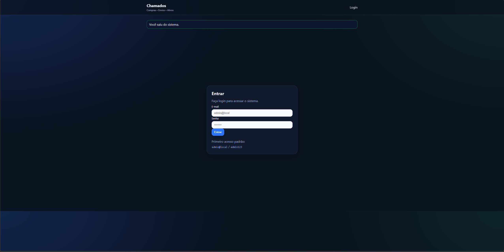
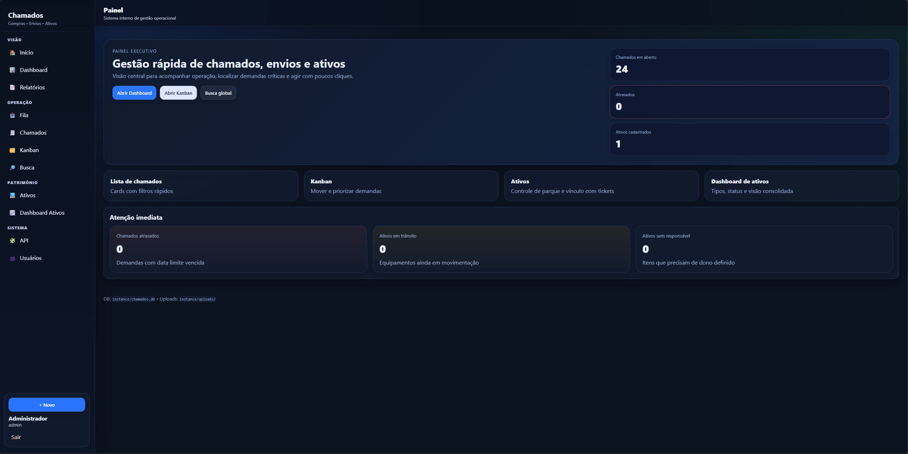
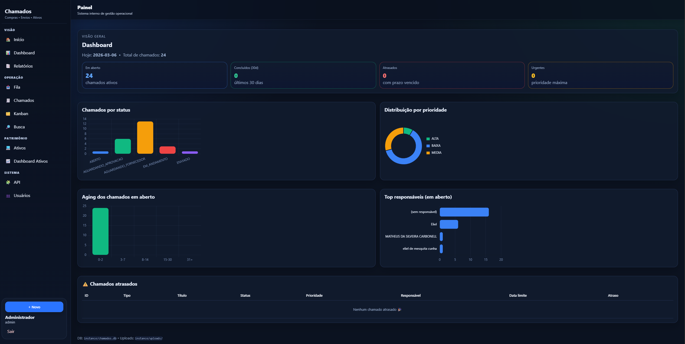
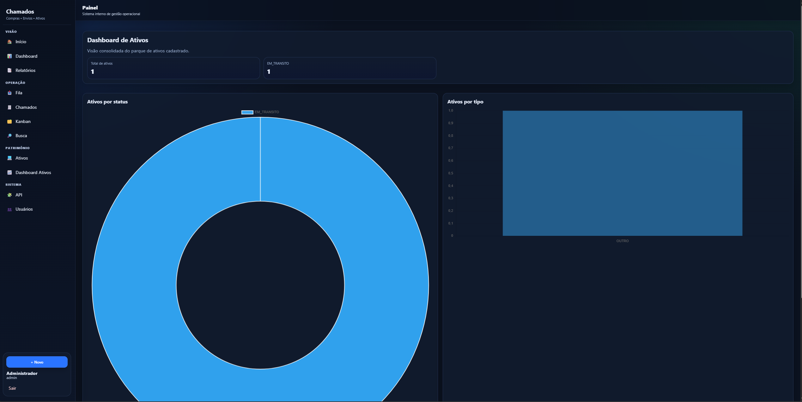
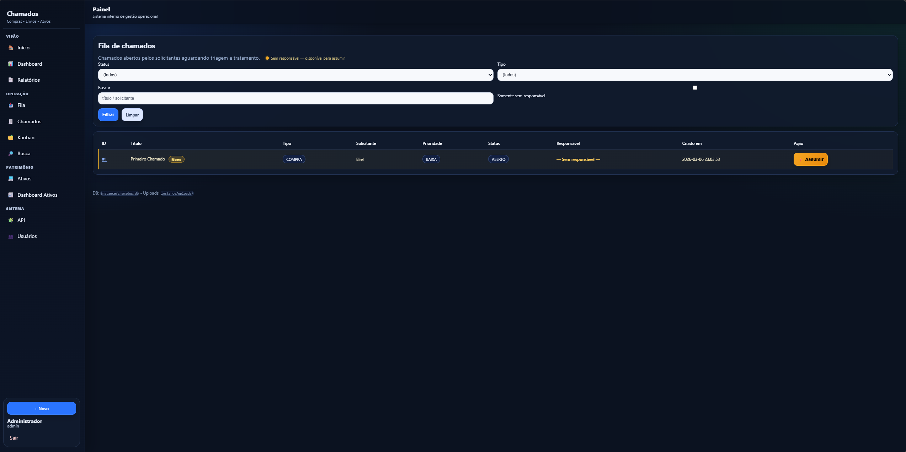
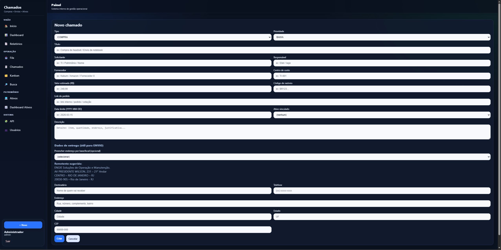
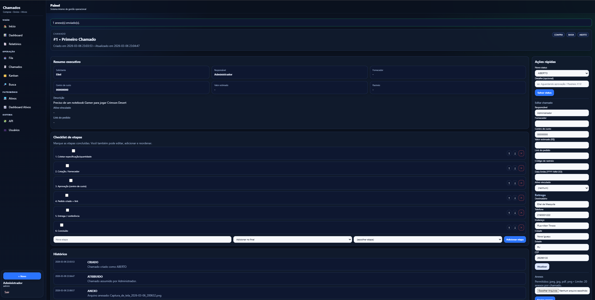

# CcTI Desk

Sistema interno de Service Desk para gestão de chamados, ativos de TI, estoque e entradas fiscais — desenvolvido em Python com Flask e SQLite.

> **Stack:** Python 3.11+ · Flask 3 · SQLite (WAL) · Jinja2 · Chart.js · APScheduler · Gemini AI (opcional)

---

## Demonstração

### Login e tela inicial




### Dashboard




### Chamados

| Fila operacional | Kanban |
|---|---|
|  |  |

| Abertura de chamado | Tratamento |
|---|---|
|  |  |

### Ativos, usuários e API

| Ativos | Usuários | API |
|---|---|---|
|  |  |  |

### Busca global


---

## Funcionalidades

### Chamados e fluxo de trabalho

- Abertura por solicitante ou operador com categorização obrigatória
- Fluxo de status com validação de transições (ABERTO → EM_ANDAMENTO → ... → CONCLUIDO)
- Aprovação/reprovação por admin quando exigido pela categoria
- Transferência entre operadores com motivo e histórico
- Devolução ao solicitante para complemento de informações
- Finalização com confirmação do solicitante (AGUARDANDO_CONFIRMACAO)
- Reabertura controlada com janela de tempo configurável
- Checklist por chamado (padrão por categoria ou manual)
- Comentários públicos e notas internas
- Anexos com validação de extensão e limite por tipo
- Numeração automática sequencial (REQ-XXXX / INC-XXXX)
- SLA automático por categoria com alerta visual (ok / warning / breach)
- TMA (Tempo Médio de Atendimento) calculado e armazenado

### Fila e atribuição

- Fila operacional com filtros por status, tipo e categoria
- Operadores veem apenas chamados das suas categorias
- Autoatribuição por timeout via scheduler (round-robin por carga)
- Atribuição a grupos de operadores

### Patrimônio e estoque

- Cadastro de ativos com tag, tipo, modelo, serial, local e responsável
- Histórico completo de ciclo de vida do ativo
- Estoque de consumíveis com alerta de mínimo
- Entrada por NF em lote (rascunho → preview → confirmação atômica)
- Catálogo de produtos para agilizar entradas
- Reversão segura de NF confirmada com validações

### Inteligência e relatórios

- Dashboard com KPIs, aging, top responsáveis e funil
- Relatórios exportáveis em XLSX e PDF
- Auditoria completa de logs com filtros e exportação
- Assistente de IA para abertura e documentação de resolução (Gemini)
- Base de conhecimento com artigos vinculados a chamados

### Infraestrutura

- Notificações por e-mail (SMTP assíncrono) e in-app
- Webhooks configuráveis para integração externa
- Chamados recorrentes (diário, semanal, mensal)
- Backup automático diário do banco
- Digest matinal por e-mail
- Portal externo via token para acompanhamento sem login
- API REST JSON

---

## Perfis de acesso

| Perfil | Escopo |
|---|---|
| **admin** | Acesso total — usuários, categorias, aprovações, logs, configurações |
| **operador** | Fila, chamados das suas categorias, ativos, estoque, NF |
| **solicitante** | Abertura e acompanhamento dos próprios chamados |

---

## Segurança

| Proteção | Implementação |
|---|---|
| CSRF | Flask-WTF com token automático em todos os formulários |
| Rate limiting | flask-limiter — login 10/min, chamados 20-60/h, API 300/h |
| Senhas | Hash com Werkzeug (PBKDF2-SHA256) |
| Sessões | Cookie assinado com SECRET_KEY + expiração por inatividade (8h) |
| Uploads | Validação de extensão + `secure_filename` |
| Permissões | Decorators `@login_required` e `@role_required` por rota |
| Banco | PRAGMA foreign_keys=ON, WAL mode, 16 índices de performance |

---

## Arquitetura

O projeto segue uma arquitetura em camadas com separação clara de responsabilidades:

```
┌─────────────────────────────────────────────────────────────┐
│  USUÁRIOS          Solicitante · Operador · Admin · Portal  │
├─────────────────────────────────────────────────────────────┤
│  APRESENTAÇÃO      Jinja2 + HTML/CSS/JS + Chart.js          │
│                    Dashboard · Chamados · Fila · Kanban      │
│                    Ativos · Estoque · NF · KB · Admin        │
├─────────────────────────────────────────────────────────────┤
│  ROTAS (Flask)     12 módulos de rota organizados por        │
│                    domínio: tickets, queue, workflow,         │
│                    approval, search, logs, comments...        │
├─────────────────────────────────────────────────────────────┤
│  SERVIÇOS          16 serviços de negócio independentes:     │
│                    ticket · sla · approval · workflow         │
│                    comment · webhook · group · category       │
│                    asset · stock · nf · search · dashboard    │
│                    auth · user · catalogo                     │
├─────────────────────────────────────────────────────────────┤
│  INFRAESTRUTURA    Notificações · Webhooks · Scheduler       │
│                    CSRF · Rate Limit · Auth/RBAC              │
├─────────────────────────────────────────────────────────────┤
│  BASE              constants.py · helpers.py · config.py     │
│                    extensions.py · db.py                      │
├─────────────────────────────────────────────────────────────┤
│  DADOS (SQLite)    Chamados · Usuários · Patrimônio          │
│                    Conhecimento · Sistema                     │
├─────────────────────────────────────────────────────────────┤
│  INTEGRAÇÕES       SMTP · Gemini AI · Webhooks · Sentry      │
├─────────────────────────────────────────────────────────────┤
│  BACKGROUND JOBS   Backup · Digest · Autoatribuição          │
│  (APScheduler)     Recorrentes · Limpeza NF                  │
└─────────────────────────────────────────────────────────────┘
```

> O diagrama completo editável está disponível em [`docs/CcTI_Desk_Arquitetura_v3.drawio`](docs/CcTI_Desk_Arquitetura_v3.drawio) — abra no [draw.io](https://app.diagrams.net).

### Estrutura de diretórios

```
app/
├── __init__.py              # Factory do Flask + registro de blueprints
├── constants.py             # Constantes de negócio centralizadas
├── helpers.py               # Funções utilitárias compartilhadas
├── config.py                # Configuração via variáveis de ambiente
├── db.py                    # Conexão, schema e migrações SQLite
├── extensions.py            # CSRF + Rate Limiter (instâncias)
├── models.py                # Camada de compatibilidade (re-exports)
├── auth/
│   ├── __init__.py          # Blueprint de autenticação (login/logout)
│   └── decorators.py        # @login_required, @role_required
├── routes/                  # 12 módulos de rota por domínio
│   ├── __init__.py          # Blueprint hub
│   ├── tickets.py           # CRUD, detalhes, upload, etapas
│   ├── queue.py             # Fila, kanban
│   ├── workflow.py          # Transferir, reabrir, devolver, finalizar
│   ├── approval.py          # Aprovações
│   ├── comments.py          # Comentários
│   ├── search.py            # Busca global, avançada, export CSV
│   ├── logs.py              # Auditoria, export Excel/PDF
│   ├── groups.py            # Grupos de operadores
│   ├── webhooks.py          # Configuração de webhooks
│   ├── recurring.py         # Chamados recorrentes
│   ├── dashboard.py         # Dashboard, home, index
│   └── api_routes.py        # Endpoints API (notificações, IA, TMA)
├── services/                # 16 serviços de negócio
│   ├── ticket_service.py    # Core: CRUD, status, etapas, anexos
│   ├── sla_service.py       # SLA e TMA
│   ├── approval_service.py  # Aprovação/reprovação
│   ├── workflow_service.py  # Transferência, reabertura, devolução
│   ├── comment_service.py   # Comentários e notas internas
│   ├── webhook_service.py   # Disparo de webhooks
│   ├── group_service.py     # Grupos de operadores
│   ├── category_service.py  # Categorias de chamados
│   ├── search_service.py    # Busca avançada
│   ├── dashboard_service.py # Dashboard e métricas
│   ├── asset_service.py     # Ativos de TI
│   ├── stock_service.py     # Estoque de consumíveis
│   ├── nf_service.py        # Entrada por NF (lote)
│   ├── auth_service.py      # Autenticação
│   ├── user_service.py      # Gestão de usuários
│   ├── catalogo_service.py  # Catálogo de produtos
│   └── ai/                  # Integração com Gemini AI
├── admin.py                 # Gestão de usuários e categorias
├── assets_admin.py          # Interface de ativos
├── stock.py                 # Interface de estoque
├── nf.py                    # Interface de NF
├── catalogo.py              # Interface de catálogo
├── kb.py                    # Base de conhecimento
├── portal.py                # Portal externo via token
├── api.py                   # API REST
├── reports.py               # Relatórios
├── scheduler.py             # Jobs em background
├── notifications.py         # Sistema de notificações in-app
├── notify.py                # Envio de e-mail assíncrono
├── ai_service.py            # Orquestração da IA
├── templates/               # 30+ templates Jinja2
└── static/                  # CSS (design system próprio)
tests/
└── test_smoke.py            # Suite com pytest (30+ casos)
docs/
└── CcTI_Desk_Arquitetura_v3.drawio  # Diagrama de arquitetura
```

---

## Início rápido

### Requisitos

- Python 3.11+
- pip

### Instalação

```bash
git clone <seu-repo>
cd ccti-desk

python -m venv .venv
source .venv/bin/activate       # Linux/Mac
# .venv\Scripts\activate        # Windows

pip install -r requirements.txt
```

### Executar

```bash
python run.py
```

Acesse em [http://localhost:5000](http://localhost:5000).

**Login padrão:** `admin@local` / `admin123`

> Altere as credenciais via variáveis de ambiente antes de usar em produção.

---

## Configuração

Copie `.env.example` para `.env` e preencha conforme o ambiente:

```env
# Obrigatório em produção
SECRET_KEY=gere-com-python-c-import-secrets-print-secrets-token-hex-32

# Admin padrão (criado na 1ª execução)
ADMIN_DEFAULT_EMAIL=admin@suaempresa.com
ADMIN_DEFAULT_PASSWORD=senha-forte

# SMTP para e-mails (opcional)
SMTP_HOST=smtp.gmail.com
SMTP_PORT=587
SMTP_USER=chamados@suaempresa.com
SMTP_PASS=senha-de-app
SMTP_FROM=chamados@suaempresa.com
ALERT_TO_EMAILS=ti@suaempresa.com

# URL pública (usada em e-mails e portal)
APP_URL=https://chamados.suaempresa.com

# IA assistida (opcional)
AI_ASSIST_ENABLED=false
AI_API_KEY=
AI_MODEL=gemini-1.5-flash

# Regras de negócio
TICKET_REOPEN_WINDOW_HOURS=48
ASSIGNMENT_TIMEOUT_MINUTES=15
SESSION_LIFETIME_HOURS=8
NF_DRAFT_MAX_AGE_DAYS=30
```

Todas as variáveis disponíveis estão documentadas em [`.env.example`](.env.example).

---

## Testes

```bash
python -m pytest          # execução padrão
python -m pytest -v       # modo detalhado
```

A suíte cobre autenticação, permissões por perfil, criação e validação de chamados, paginação, API, recorrência, backup, digest e regras de negócio. O APScheduler é desabilitado automaticamente durante os testes.

---

## Deploy

### Docker

```bash
docker compose up --build
```

### Render

O projeto inclui `render.yaml` pronto. Basta conectar o repositório e configurar as variáveis de ambiente no painel do Render.

### Produção (gunicorn)

```bash
gunicorn run:app --bind 0.0.0.0:5000
```

Para rate limiting persistente entre workers, configure `RATELIMIT_STORAGE_URI=redis://...`.

---

## Tecnologias

| Camada | Tecnologias |
|---|---|
| Backend | Python 3.11, Flask 3, Werkzeug, SQLite |
| Frontend | HTML5, CSS3 (design system próprio, dark theme), Chart.js, Vanilla JS |
| Segurança | Flask-WTF (CSRF), flask-limiter, PBKDF2-SHA256 |
| Exportação | openpyxl (XLSX), ReportLab (PDF) |
| Background | APScheduler |
| IA | Google Gemini (opcional) |
| Monitoramento | Sentry (opcional) |
| Deploy | Gunicorn, Docker, Render |
| Testes | pytest |

---

## Licença

MIT — livre para usar, adaptar e distribuir.
